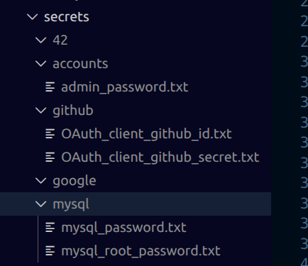

# Transcendance

## Get starting

<u>*Start docker containers*</u>
```bash
make
```
<u>*Stop docker containers (without deleting the volume)*</u>
```bash
make clean
```

<u>*Stop docker containers (without deleting the volume)* </u>
```bash
make fclean
```
<u>*See logs*</u>
```bash
make logs
```
<u>*See wich docker volumes are in execution*</u>
```bash
make ps
```
## Docker containers

<div align="center">

| Container | Port | Used for |
|:--:|:--:|:--:|
| nginx  | 443 | Reverse proxy + https entrypoint |
| mariadb  | 3306  | Database  |
| expressjs | 3000 | Backend |
| reactjs | 5173 | Frontend |

</div>

## Docker secrets

### <u>List of secrets </u>

<div align="center">

| Secret | Description |
|:---:|:---:|
| OAuth_client_github_id | Id for github OAuth |
| OAuth_client_github_secret | Secret for github OAuth |
| admin_password | Password for admin account |
| mysql_password | Password for mysql password |
| mysql_root_password | Password for mysql root password |

</div>

### <u> How to set them up </u>
-> Create a directory named `secrets` inside docker directory  
-> Create those files and directories 
  
-> Ask `chhoflac` to give you the id and secret for github  
-> Write whatever passwords you want in the others (no spaces, only one line)

### <u> Env variables </u>

-> Create a `.env` file  
-> Set up a mame for the database in `$MYSQL_DATABASE` and `MYSQL_USER` for user name  
-> Create `JWT_SECRET` by using ``openssl rand -hex 32 `` 

## Docker volumes
### <u>List of docker volumes</u>
<div align="center">

| Volume | Description |
|:---:|:---:|
| express_node_modules | Express packages |
| react_node_modules | React packages |
| mariadb_data | Database volume |
| file_container | Files uploaded by accounts |

</div>

## Technologies and how to use them

<div align="center">
<h3><u>Infrastructure</u></h3>
</div>

### Docker
### Nginx
### MariaDB


<div align="center">
<h3><u>Frontend</u></h3>
</div>

### react  
### typescript  
### vite  
### i18n
### react-router-dom
### bootstrap
### Sass

<div align="center">
<h3><u>Backend</u></h3>
</div>

### Node.js
### Express 5
### tsx + nodemon
### mysql2
### bcrypt
### jsonwebtoken
### cookie-parser
### helmet
### cors	
### express-rate-limit	
### multer	
### sharp	
### file-type

<div align="center">
<h3><u>OAuth</u></h3>
</div>

### Google
### Github
### 42

## Database

## Backend

## Frontend

## Technical decisions

## Login with admin

## Modules


